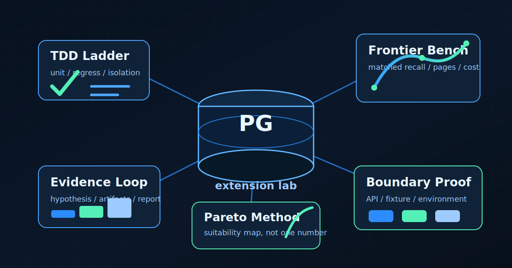

# pg-extension-lab



**pg-extension-lab is a harness for developing, testing, benchmarking, and tuning a
PostgreSQL extension — validating observable behavior in an isolated, reproducible
environment, separately from the implementation.**

A [Claude Code](https://docs.claude.com/en/docs/claude-code) skill, distilled from real
C/PGXS, Rust/pgrx, GPU/CUDA, and extension+microservice projects. Use it to build an
extension from scratch, **or** to design tuning experiments, write scenarios, and run
isolation/regression tests against an existing one. Packaged as a Claude Code **plugin
marketplace** (`.claude-plugin/`) so it installs without manual symlinks.

## Why This Exists

Most PostgreSQL extension work fails in the gaps: a green unit test that never loaded the
`.so`, a benchmark that compares mismatched recall, a fast path that only wins because the
fixture is too friendly, or a service integration where the API, fixture, and environment each
tell a different story.

This skill turns those hard lessons into reusable working material:

- copy-ready PGXS/pgrx test ladders, isolation specs, and CI fragments;
- filtered ANN and accelerator benchmark harnesses with bounded parameter-space planning;
- Pareto/frontier reporting that explains where an option fits, not just which number won;
- hypothesis, evidence, and report templates that keep claims tied to raw artifacts;
- service-boundary contracts that separately verify API shape, fixture meaning, and effective
  runtime environment.

The point is not to add ceremony. The point is to make feedback faster, sharper, and harder to
fake.

## What's inside

The skill lives at [`skills/pg-extension-lab/`](skills/pg-extension-lab/SKILL.md): three
architecture shapes (in-process / microservice / out-of-process daemon) across five reference
categories — **testing** (C unit / `pg_regress` golden-file / `pg_isolation_regress`
concurrency), **benchmarking** (matched-recall, trust labeling, accelerator-vs-CPU crossover,
cost-per-query), **performance** (resource-vs-performance Pareto, governance), **architecture**
(Rust/pgrx, async outbox workers, service-boundary contracts, security), and **accelerator**
(GPU/CUDA specifics).

## Install

### As a Claude Code plugin (recommended)

```text
/plugin marketplace add ysys143/pg-extension-lab
/plugin install pg-extension-lab
```

Claude Code clones the repo, registers the bundled skill, and handles updates via the plugin
manager. The skill auto-activates by its `description`; invoke it explicitly with
`/pg-extension-lab`.

### Manual (clone + symlink)

```bash
git clone https://github.com/ysys143/pg-extension-lab.git ~/src/pg-extension-lab
ln -s ~/src/pg-extension-lab/skills/pg-extension-lab ~/.claude/skills/pg-extension-lab
```

## Layout

```
pg-extension-lab/
  .claude-plugin/
    marketplace.json     # this repo as a Claude Code marketplace
    plugin.json          # plugin manifest; skills: ./skills/
  skills/
    pg-extension-lab/
      SKILL.md           # overview + navigation
      references/        # testing/ benchmarking/ performance/ architecture/ accelerator/ harnesses/
      assets/            # reusable harness templates: testing, benchmarks, service contracts, ops
  README.md
  LICENSE
```

The `skills/` layout leaves room to add more skills later (`skills/<name>/SKILL.md`); the
plugin manifest's `"skills": "./skills/"` picks them up automatically.

## License

MIT
